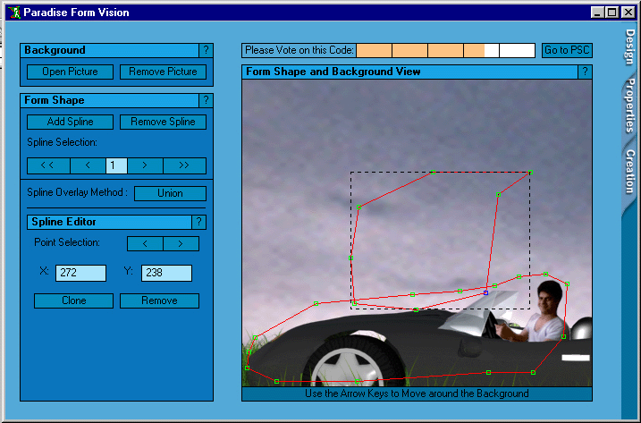



## Paradise Form Vision

### Description

This is the best form shaping program ever. All you have to do is to draw a shape on the background you wish your form to have, set the form's properties (if you wish) and then you will have a complete shaped form to add to your project. For more information, just DOWNLOAD IT!
 
### More Info
 

             |
---                |---
**Submitted On**   |2002-06-25 03:58:46
**By**             |[Hesan Feghhi](https://github.com/Planet-Source-Code/PSCIndex/blob/master/ByAuthor/hesan-feghhi.md)
**Level**          |Advanced
**User Rating**    |4.5 (27 globes from 6 users)
**Compatibility**  |VB 5\.0, VB 6\.0
**Category**       |[Complete Applications](https://github.com/Planet-Source-Code/PSCIndex/blob/master/ByCategory/complete-applications__1-27.md)
**World**          |[Visual Basic](https://github.com/Planet-Source-Code/PSCIndex/blob/master/ByWorld/visual-basic.md)
**Archive File**   |[Paradise\_F983266242002\.zip](https://github.com/Planet-Source-Code/hesan-feghhi-paradise-form-vision__1-36224/archive/master.zip)

